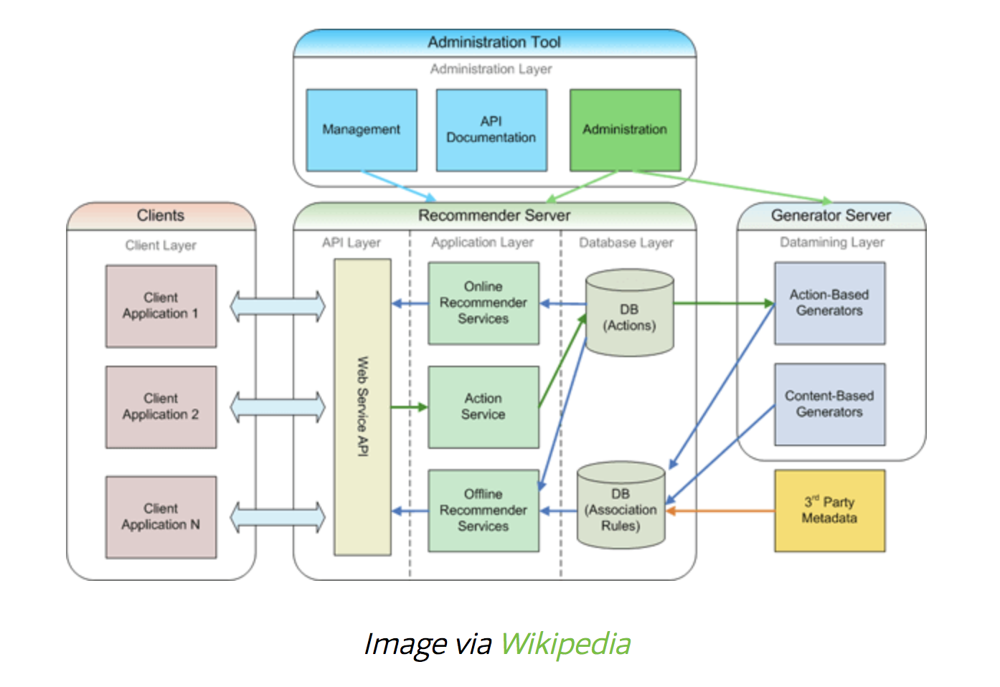

# Design & Specification

## Description

  This page will explain about Jelly project's design and specification. Project design indicate basic architecture of personal website with some contents and components. The specification will include details of the design and list skills to build the website. Furthermore, the spec page should explain how to implement this website.

## Back Ground

### Web Application

Two programs running concurrently

* The code which lives in the browser and responds to user input
* The code which lives on the server and responds to HTTP requests

Trends in Web Application Architecture

* Creation of **service-oriented architecture**.
* It has its own HTTP API.
* One of the code can make a request to another part of the code-which may be running on a different server.
* Another trend is a **single-page application**.
  * Uses AJAX or WebSockets for performing asynchronous or synchronous requests to the web server without having to load the page.
* Many web applications are built around objects. The objects are stored in tables via an SQL databases.

### Architecture

* Web application architecture - [Web application architecture: The whole stack - Allen Holub](https://www.youtube.com/watch?v=SgEFNRf67Cw)
* Mindmap - [https://coggle.it/diagram/WMMEvSoNyAABBX2w/t/web-development-in-2018/b97ca171d59ba2ab3b7ea8da244a8ed3a154ffa067568635fe2676068a1d44d0](https://coggle.it/diagram/WMMEvSoNyAABBX2w/t/web-development-in-2018/b97ca171d59ba2ab3b7ea8da244a8ed3a154ffa067568635fe2676068a1d44d0)

### Web Application Best Practices

* Solve problems consistently and uniformly, as simple as possible
* Includes latest standards include A/B testing and anlytics
* Fast response times
* Security standards
* Heals itself
* Does not have a single point of failure
* Scales out easily
* Errors logged in a user-friendly way
* Automated Deployments

## UI Design

  Sample UI design for personal portfolio website. 

* [Jacob Heflin](https://jacobheflin.com/) builtin with Wordpress plugins, php, Bootstrap, jQuery.

* [Jim Ramsden](https://jimramsden.com/) -  Google Font API, jQuery, Modernizr

* [Walter Cruz](http://waltercruz.strikingly.com/) - React, Nginx, Webpack, jQuery

_Suggested Tech: React, Lua?, Webpack, Nginx, Google Font API, \[jQuery\],_  [_Jekyll_](https://github.com/qwtel/hydejack/blob/master/assets/img/blog/hydejack-8.png)\_\_

## Specification & Components

### About Me & Profile

  Background picture, Photo, Name, basic information. Technical skills, biography, and background.

### Portfolio & Projects

  List what I've done so far related to the project and internship experience. May include MMT, Purdue, School Projects.

### What I'm interested in \(Blogging\)

  Hobbies, sports, travel, study.. whatever I am interested in. This feature will include writing articles on this website. \([https://www.joelonsoftware.com/](https://www.joelonsoftware.com/) can be a reference\)

### Contact Me

  LinkedIn, Github, Twitter, Facebook, email - contact information

